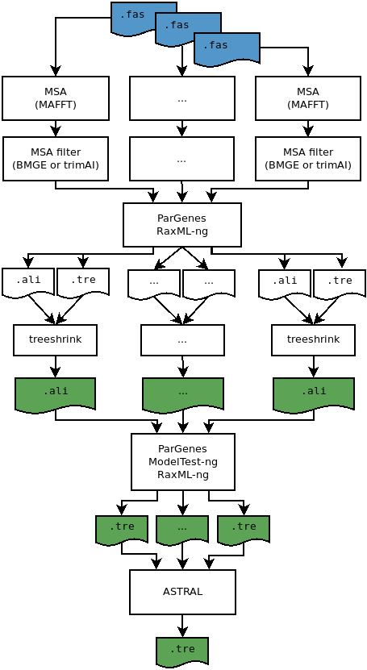

# ATPW - Align-and-Trees-Parallel-Workflow

- Last modified: fre mar 22, 2024  01:37
- Sign: Johan.Nylander\@nrm.se

## Description

Script for running a "standard" phylogenetic workflow on fasta-formatted input.
In particular, parallel execution is done whenever possible.

The default steps on unfiltered and unaligned fasta files as input (see [Input
data](#input-data)) are:

1. Create multiple sequence alignments with
   [MAFFT](https://mafft.cbrc.jp/alignment/software/),
2. filter alignments using
   [BMGE](https://bmcecolevol.biomedcentral.com/articles/10.1186/1471-2148-10-210)
   or [TrimAl](https://github.com/inab/trimal)
3. infer phylogenetic trees for each filtered locus with fixed model using
   [ParGenes](https://github.com/BenoitMorel/ParGenes) and
   [RAxML-NG](https://github.com/amkozlov/raxml-ng),
4. filter trees using [TreeShrink](https://github.com/uym2/TreeShrink),
5. do multiple sequence alignments on TreeShrink-filtered data using MAFFT,
6. infer phylogenetic trees for each locus with model selection using
   [ModelTest-NG](https://github.com/ddarriba/modeltest), RAxML-NG, and
   ParGenes,
7. estimate species tree from individual trees using
   [ASTER](https://github.com/chaoszhang/ASTER) or
   [ASTRAL](https://github.com/smirarab/ASTRAL).

Using MAFFT, BMGE, TrimAl, TreeShrink, and ASTER/ASTRAL are optional (see
[Options](#options)).

## Usage

    $ align-and-trees-parallel-workflow.sh -d nt|aa [options] /path/to/folder/with/fas/files /path/to/output/folder
    $ align-and-trees-parallel-workflow.sh -h

## Options

Positional parameters are input- and output-folders. Output folder will be created (and not overwritten).

    -d type   -- Specify data type: nt or aa. (Mandatory)
    -n number -- Specify the number of threads. Default: nr available cores
    -m crit   -- Model test criterion: BIC, AIC or AICC. Default: BIC
    -i number -- Number of bootstrap iterations. Default: 0
    -f number -- Minimum number of taxa when filtering alignments. Default: 4
    -s prog   -- Specify ASTRAL/ASTER program: astral.jar, astral, astral-pro, or astral-hybrid. Default: astral
    -l prog   -- Specify alignment filter software: bmge or trimal. Default: bmge
    -b opts   -- Specify options for alignment-filter program. Multiple options needs to be quoted. Default: program defaults
    -t opts   -- Specify options for TreeShrink. Multiple options needs to be quoted. Default: program defaults
    -a opts   -- Specify options for aligner (default mafft). Multiple options needs to be quoted. Default (for mafft): --auto --thread 2 --quiet
    -A        -- Do not run aligner (assume aligned input)
    -B        -- Do not run alignment-filter program
    -T        -- Do not run TreeShrink
    -S        -- Do not run ASTER/ASTRAL (no species-tree estimation)
    -v        -- Print version
    -h        -- Print help message

Default settings for most software are used in the workflow. Some default
values can be changed by using options or by manually editing the
[script](src/align-and-trees-parallel-workflow.sh). A list of options for BMGE
can be found here: [BMGE.md](doc/BMGE.md), otherwise consult the program web
pages.

If bootstrapping is used (`-i`), then the species-tree estimation tool is
automatically changed to `astral-hybrid` (unless other program is chosen using
`-s`).

## Input data

Unaligned aa or nt sequences in fasta formatted files, one per locus, placed in
a folder (which is the first argument to the script). The number of sequences
in the files does not need to be the same, but sequence labels should match if
the data comes from the same sample.  **File names should end in `.fas`**.
Example: `EOG7CKDX2.fas`.  The part `EOG7CKDX2` will be used as locus name in
down stream analyses. See [example data](data).

The sequences in the input files are assumed to be unaligned, and where the
first step in the workflow is to attempt to do multiple-sequence alignment.  If
the input files are already aligned, the workflow can be started with the
`-A` option.

## Output

From a default run (mafft + bmge + threeshrink + mafft + modeltest-ng + raxml-ng +
astral)

- Alignments in `outputfolder/1_align/`
- Gene trees in
  `outputfolder/2_trees/2.2_mafft_bmge_treeshrink_pargenes/mlsearch_run/results`
- Species tree in
  `outputfolder/2_trees/2.2_mafft_bmge_treeshrink_pargenes/aster_run/` 
- Log file in `outputfolder/ATPW.log`
- Summary file in `outputfolder/README.md`

## Installation

For a local installation, see the [`INSTALL`](INSTALL) file.

As an alternative, and if you have
[Singularity/Apptainer](https://apptainer.org) installed, you may use a
singularity file. See the [README](singularity/README.md) for details.

### Important caveats

* The default path to some helper software are **hard coded (full path) in the
  script**. These could be overridden at execution by using, for example,
  `BMGEJAR=/path/to/BMGE-1.12/BMGE.jar align-and-trees-parallel-workflow.sh`.
  More convenient, however, is to edit the script
  [`align-and-trees-parallel-workflow.sh`](src/align-and-trees-parallel-workflow.sh)
  directly.
* The optimal total number of cores in combination with the number of parallel
  processes for GNU parallel, and in combination with number of cores used for
  child processes are not yet optimized, nor checked for inconsistencies.
* The current version of [ThreeShrink does not run with python versions
  \>3.8](https://github.com/uym2/TreeShrink/issues/33). Using the singularity
  file, or editing the TreeShrink code (see
  <https://github.com/nylander/Align-and-trees-parallel-workflow/issues/2>),
  are two alternatives.

## Acknowledgements

Workflow image drawn by Alice Kastor.

